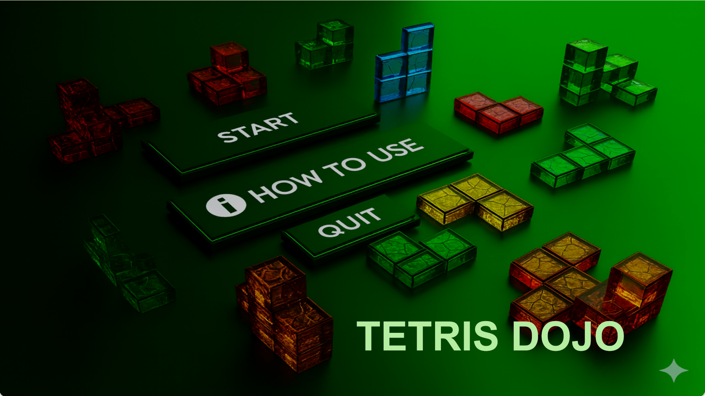
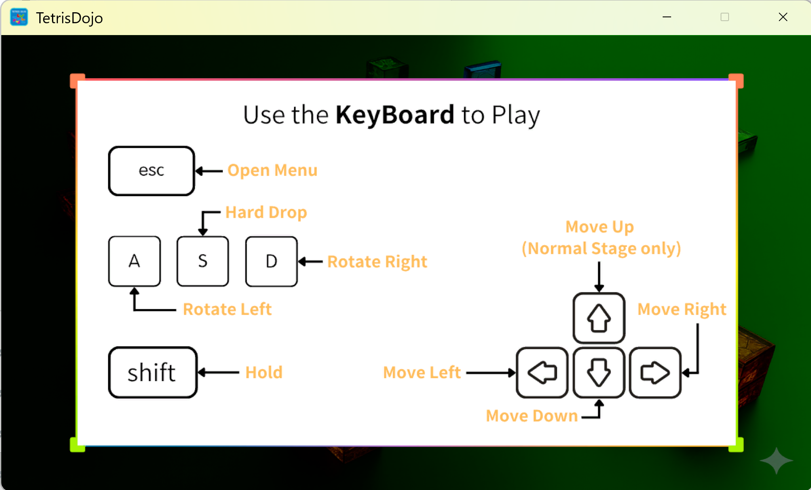
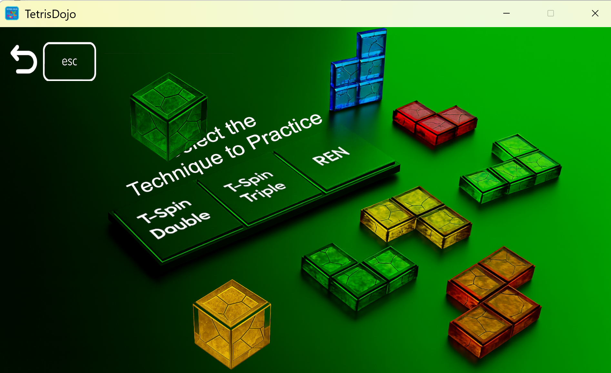
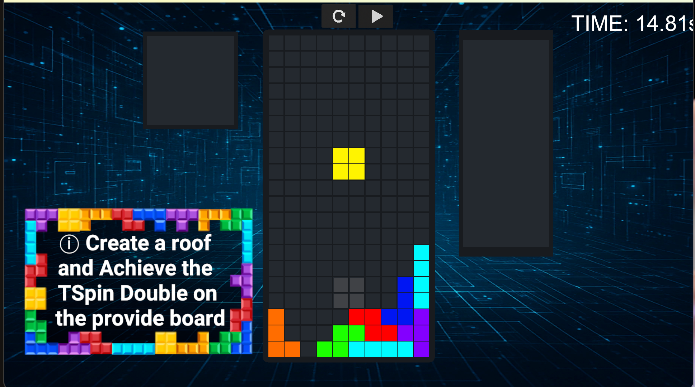
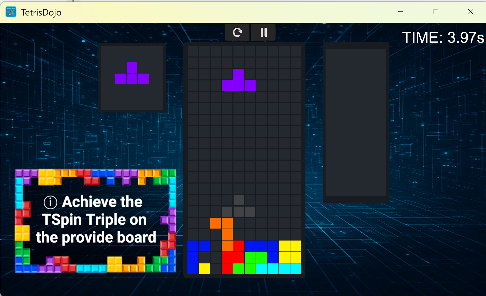
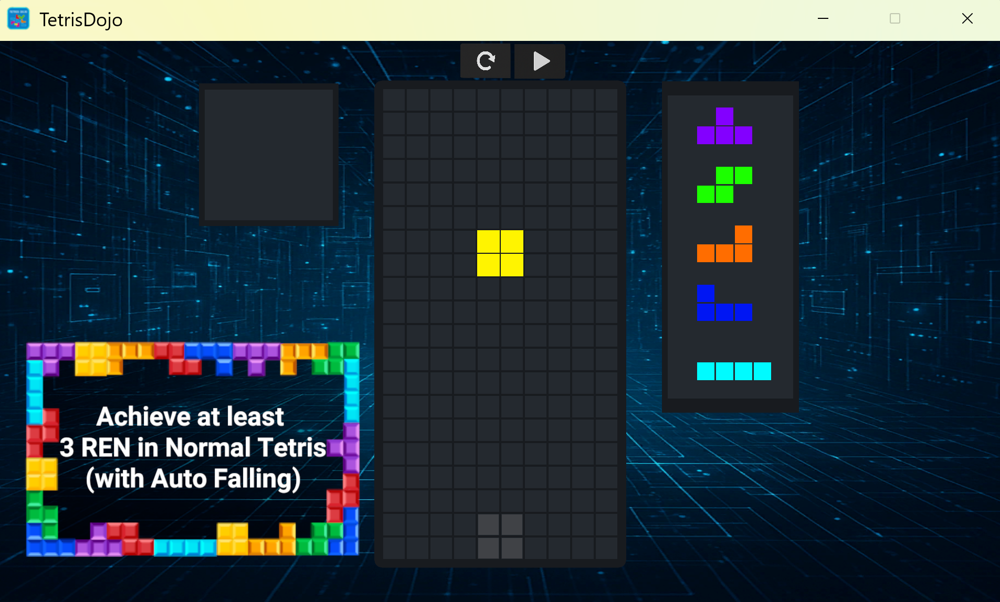
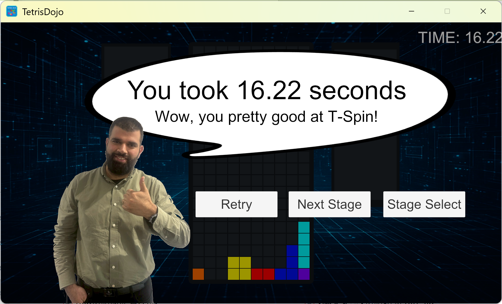

# Tetris Trainer (Unity Project)

A practice tool for advanced Tetris techniques such as T-Spin Double, T-Spin Triple, and REN chains.

This application allows players to practice specific setups in an offline environment and slow down gameplay to better understand piece placement.

Developed using Unity and C# as part of a Software Design course project.

## Screenshots

### Title Screen

### Control Guide

### Practice Mode Selection

### T-Spin Double Practice

### T-Spin Triple Practice

### REN Practice

### Game Clear

